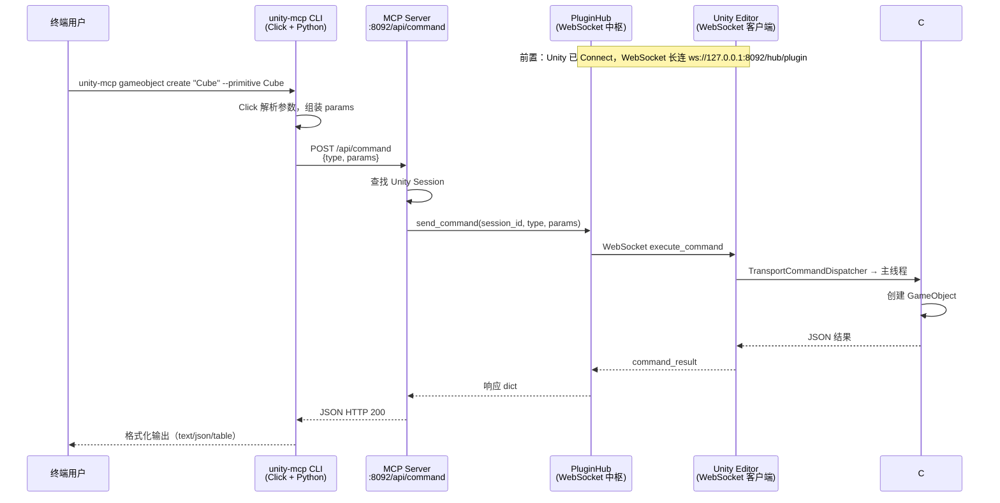

# CLI 操作 Unity 完整周期

本文描述在 **HTTPLocal** 模式下，通过 `unity-mcp` CLI 从终端发出一条命令到 Unity Editor 执行并返回结果的完整链路。

> **适用场景**：终端脚本、CI、本地自动化。默认假设 MCP Server 监听 `http://127.0.0.1:8092`（端口以 Unity **MCP for Unity → Connect** 页配置为准）。

> **不包含**：stdio 模式下 Unity `:6400` 的 socket 桥接（那是另一套传输栈，与 HTTPLocal 无关）。

---

## 架构总览



---

## 前置条件

### 1. MCP Server 已启动

Unity **Window → MCP for Unity → Connect**：

- **Transport**：`HTTPLocal`
- **HTTP URL**：例如 `http://127.0.0.1:8092`
- 点击 **Start Server**（或外部已启动等价进程）
- **Session Status** 不为 `No Session`（需点击 **Connect**）

### 2. CLI 可执行

从仓库 `Server/` 目录：

```bash
cd Server
uv run unity-mcp --help
```

或通过 PyPI 安装的 `unity-mcp` 命令（需能访问同一端口的 MCP Server）。

### 3. 环境变量（可选）

| 变量 | 默认 | 说明 |
|------|------|------|
| `UNITY_MCP_HOST` | `127.0.0.1` | MCP Server 地址 |
| `UNITY_MCP_HTTP_PORT` | `8080` | 端口（HTTPLocal 常改为 `8092`） |
| `UNITY_MCP_TIMEOUT` | `30` | 单次命令超时（秒） |
| `UNITY_MCP_INSTANCE` | — | 多实例时指定 `Name@hash` |
| `UNITY_MCP_FORMAT` | `text` | 输出格式：`text` / `json` / `table` |

命令行等效：`-h`、`-p`、`-t`、`-i`、`-f`。

---

## 单次命令完整周期（以创建 GameObject 为例）

### 阶段 0：进程启动（每次调用 CLI 都会发生）

```
uv run unity-mcp -p 8092 gameobject create "MyCube" --primitive Cube
```

1. Shell 启动子进程
2. `uv` 解析环境、激活 venv
3. Python 加载 `cli.main`，Click 注册命令组
4. 解析全局选项（host/port/timeout/instance/format）

**耗时影响**：约 **500–600 ms** 量级（冷启动），与 Unity 无关。脚本/automation 若每次 `subprocess` 调用 CLI，会把这段算进总延迟。

### 阶段 1：CLI 命令层

入口：`Server/src/cli/commands/gameobject.py` → `create()`

1. `@handle_unity_errors` 装饰器就绪（捕获 `UnityConnectionError`）
2. 将 CLI 参数转为 Unity 侧 params：

   ```python
   {
       "action": "create",
       "name": "MyCube",
       "primitiveType": "Cube",   # CLI 使用 camelCase
       # position, rotation, scale, parent, tag, ...
   }
   ```

3. 调用 `run_command("manage_gameobject", params, config)`

### 阶段 2：HTTP 客户端层

文件：`Server/src/cli/utils/connection.py`

1. 构造 URL：`http://{host}:{port}/api/command`
2. 构造 body：

   ```json
   {
     "type": "manage_gameobject",
     "params": { "action": "create", "name": "MyCube", "primitiveType": "Cube" }
   }
   ```

3. 若设置了 `-i` / `UNITY_MCP_INSTANCE`，附加 `unity_instance`
4. `httpx.AsyncClient.post()`，等待响应
5. 非 2xx 或连接失败 → 抛出 `UnityConnectionError`

**注意**：CLI **不走** MCP 协议（不访问 `/mcp`），也 **不经过** Python Tool 包装层（`services/tools/manage_gameobject.py`）。

### 阶段 3：MCP Server REST 路由

文件：`Server/src/main.py` → `cli_command_route`

1. 解析 JSON body，读取 `type`、`params`、`unity_instance`
2. `PluginHub.get_sessions()` — 无 Session 则 **503**
3. 选择目标 Session（指定 instance 或第一个可用）
4. **直接**调用：

   ```python
   await PluginHub.send_command(session_id, command_type, params)
   ```

5. 将 Unity 返回包装为 `JSONResponse` 返回 CLI

这是 HTTPLocal 下 **Server 到 Unity 的最短路径**（与 `benchmark --via rest` 一致）。

### 阶段 4：PluginHub → Unity WebSocket

文件：`Server/src/transport/plugin_hub.py`

1. 生成 `command_id`（UUID）
2. 构造 `ExecuteCommandMessage`（name = `manage_gameobject`，params = …）
3. `websocket.send_json()` 发往 Unity 插件
4. 注册 pending future，等待 `command_result`
5. Unity 返回后 resolve future，结果回传 REST 层

Unity 侧 WebSocket 地址：`ws://127.0.0.1:8092/hub/plugin`（由 HTTP URL 推导）。

### 阶段 5：Unity Editor 执行

文件：

- `MCPForUnity/Editor/Services/Transport/Transports/WebSocketTransportClient.cs` — 收包
- `MCPForUnity/Editor/Services/Transport/TransportCommandDispatcher.cs` — 主线程调度
- `MCPForUnity/Editor/Tools/ManageGameObject.cs` — 实际创建逻辑

1. `HandleExecuteAsync` 收到 execute 消息
2. 封装为 `{ type, params }` JSON
3. `TransportCommandDispatcher.ExecuteCommandJsonAsync` — **必须在 Unity 主线程**执行
4. `CommandRegistry` 路由到 `ManageGameObject`
5. 在场景中创建 Cube，生成 `instanceID` 等
6. 序列化为 `{ status: "success", result: { success, message, data } }`
7. WebSocket 回传 `command_result`

### 阶段 6：响应返回 CLI

1. PluginHub → `cli_command_route` → httpx → Click
2. `format_output()` 按 `-f` 格式打印
3. 进程退出，返回码 `0`（失败为 `1`）

---

## 其他 CLI 入口

| 方式 | 示例 | Server 路径 |
|------|------|-------------|
| 结构化子命令 | `unity-mcp gameobject create ...` | `/api/command` |
| 原始命令 | `unity-mcp raw manage_scene '{"action":"get_active"}'` | `/api/command` |
| 连接检查 | `unity-mcp status` | `GET /health` + `GET /api/instances` |
| 实例列表 | `unity-mcp instances` | `GET /api/instances` |

`raw` 与结构化子命令在 Server 侧路径相同，区别仅在 CLI 如何组装 `type` / `params`。

---

## 典型耗时（HTTPLocal，8092，参考 benchmark）

| 段 | 中位数（参考） | 说明 |
|----|----------------|------|
| CLI 进程冷启动 | ~580 ms | 每次新起 `uv run unity-mcp` |
| `/api/command` → Unity → 返回 | ~100 ms | 持久 HTTP 客户端下的桥接往返 |
| **CLI 单次总 wall-clock** | **~680 ms** | 冷启动 + 桥接 |

若改为 **持久 CLI 守护进程**（内部复用 httpx、不反复 spawn），可接近 **~100 ms** 桥接极限，因为 Server 路径与 REST 捷径相同。

---

## 与 MCP 路径的差异（摘要）

| 项目 | CLI |
|------|-----|
| 客户端协议 | HTTP REST `/api/command` |
| 是否经过 Python `@mcp_for_unity_tool` | **否** |
| 是否经过 FastMCP / JSON-RPC | **否** |
| Unity 连接方式 | WebSocket → PluginHub（与 MCP 相同） |
| 典型连接模式 | 每次命令新进程（默认） |

详见 [mcp-workflow.md](./mcp-workflow.md)。

---

## 故障排查

| 现象 | 可能原因 |
|------|----------|
| `Cannot connect to Unity MCP server` | Server 未启动或端口错误 |
| HTTP 503 `No Unity instances connected` | Unity 未 Connect，Session 为空 |
| 命令超时 | Unity 编译/domain reload/Editor 失焦节流 |
| Windows 下 emoji 输出崩溃 | 终端编码；设置 `PYTHONUTF8=1` |

---

## 相关源码

| 层级 | 路径 |
|------|------|
| CLI 入口 | `Server/src/cli/main.py` |
| GameObject 命令 | `Server/src/cli/commands/gameobject.py` |
| HTTP 客户端 | `Server/src/cli/utils/connection.py` |
| REST 路由 | `Server/src/main.py` (`/api/command`) |
| WebSocket 中枢 | `Server/src/transport/plugin_hub.py` |
| Unity WebSocket 客户端 | `MCPForUnity/Editor/Services/Transport/Transports/WebSocketTransportClient.cs` |
| Unity 命令调度 | `MCPForUnity/Editor/Services/Transport/TransportCommandDispatcher.cs` |
| Unity GameObject 工具 | `MCPForUnity/Editor/Tools/ManageGameObject.cs` |

---

## 本地基准测试

```bash
cd Server
uv run python ../tools/benchmark_gameobject_rtt.py --via cli --port 8092 --iterations 10 --cleanup
```

`--via rest` 测同 Server 路径但不含 CLI 进程启动开销；`--via mcp` 测 Cursor 使用的 MCP 协议路径。
