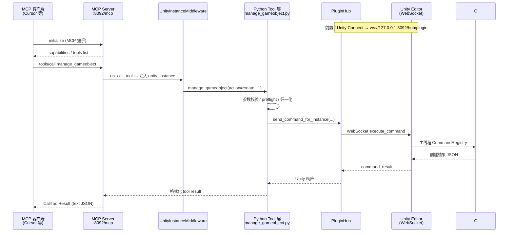

# MCP 操作 Unity 完整周期

本文描述在 **HTTPLocal** 模式下，MCP 客户端（如 Cursor、Claude Code）通过 **MCP 协议**调用工具，到 Unity Editor 执行并返回结果的完整链路。

> **适用场景**：AI IDE / Agent 通过 MCP 配置连接 Unity。默认假设 MCP Server 为 `http://127.0.0.1:8092`，MCP 端点为 `http://127.0.0.1:8092/mcp`。

> **不包含**：stdio 传输（Unity `:6400` socket 桥 + 独立 Python stdio 进程）。HTTPLocal 下 Unity 仅作为 **WebSocket 客户端**连到 MCP Server，不监听 6400 给 HTTP 模式使用。

---

## 架构总览



---

## 前置条件

### 1. MCP Server（HTTPLocal）

Unity **Window → MCP for Unity → Connect**：

| 配置项 | 示例 |
|--------|------|
| Transport | `HTTPLocal` |
| HTTP URL | `http://127.0.0.1:8092` |
| Server | Running |
| Session | Connected（非 `No Session`） |

Server 启动后提供：

- **MCP 端点**：`http://127.0.0.1:8092/mcp`（Streamable HTTP）
- **Plugin Hub**：`ws://127.0.0.1:8092/hub/plugin`（Unity 插件连接）
- **CLI REST**（可选）：`http://127.0.0.1:8092/api/command`

### 2. MCP 客户端配置

Cursor / Claude Code 等示例：

```json
{
  "mcpServers": {
    "unityMCP": {
      "url": "http://127.0.0.1:8092/mcp"
    }
  }
}
```

端口必须与 Unity Connect 页 **HTTP URL** 一致。

### 3. Unity 插件连接

Unity 内 **Connect** 后：

1. `WebSocketTransportClient` 连接 `ws://127.0.0.1:8092/hub/plugin`
2. 发送 `register`（项目名、hash、Unity 版本等）
3. 发送 `register_tools`（Editor 内启用的工具列表）
4. Server 分配 `session_id`，PluginHub 记录 Session

此后 Unity 保持 **长连接**；命令由 Server **推送到** Unity，而非 Unity 轮询。

---

## 会话生命周期

### A. 客户端 ↔ MCP Server（持久）

1. **initialize** — MCP 协议握手，交换协议版本与能力
2. **tools/list** — 获取当前可用工具（受 Unity 侧工具开关 / 分组影响）
3. **tools/call** — 执行具体工具（可重复，同一 HTTP/MCP 会话内复用连接）

Cursor 等客户端通常维持 **长连接**，不会每次 tool call 都重新 initialize。

### B. Unity ↔ PluginHub（持久）

- 连接：`WebSocketTransportClient.StartAsync()`
- 保活：keep-alive / pong
- 断线：自动重连（带 backoff）
- Domain reload：Unity 重载程序集时连接可能短暂断开，Server 端有 retry / fast-fail 逻辑

---

## 单次 tools/call 完整周期（以 manage_gameobject create 为例）

### 阶段 1：MCP 客户端发起调用

客户端发送 JSON-RPC 语义的工具调用（Streamable HTTP 封装）：

```json
{
  "name": "manage_gameobject",
  "arguments": {
    "action": "create",
    "name": "MyCube",
    "primitive_type": "Cube",
    "position": [0, 0, 0]
  }
}
```

参数名为 **Python Tool schema** 中的 snake_case（与 CLI REST 的 camelCase 不同，由 Tool 层统一处理）。

### 阶段 2：FastMCP 路由

文件：`Server/src/main.py`（FastMCP 应用）

1. 接收 `/mcp` 上的 MCP 消息
2. 解析 `tools/call`
3. 进入 middleware 链

### 阶段 3：UnityInstanceMiddleware

文件：`Server/src/transport/unity_instance_middleware.py`

`on_call_tool`：

1. 从 MCP session state 读取 / 自动选择 `unity_instance`
2. 多实例时可能需要先前调用 `set_active_instance`
3. 将 instance 写入 context，供 Tool 层使用
4. HTTP 模式下可过滤 `tools/list` 可见性（按项目注册的工具）

### 阶段 4：Python Tool 层

文件：`Server/src/services/tools/manage_gameobject.py`

与 CLI REST **不同**，MCP **必须经过**此层：

1. `@mcp_for_unity_tool` 注册的 `manage_gameobject()` 被调用
2. 参数校验与归一化（向量、bool、component_properties 等）
3. `preflight()` — 检查 Editor 是否 ready（编译中等）
4. 组装发往 Unity 的 params dict
5. 调用：

   ```python
   await send_with_unity_instance(
       async_send_command_with_retry,
       unity_instance,
       "manage_gameobject",
       params,
   )
   ```

文件：`Server/src/transport/unity_transport.py`

- HTTP 模式下：`PluginHub.send_command_for_instance(...)`
- 含 reload 重试、实例路由、响应 `normalize_unity_response`

### 阶段 5：PluginHub → Unity

与 CLI 路径 **汇合**（同一 WebSocket 通道）：

1. `send_command(session_id, "manage_gameobject", params)`
2. Unity `HandleExecuteAsync` 收到 execute
3. `TransportCommandDispatcher` 在主线程执行
4. C# `ManageGameObject` 创建 GameObject

### 阶段 6：结果回传 MCP 客户端

1. Unity → PluginHub → Python Tool
2. Tool 包装为 `{ success, message, data }`
3. FastMCP 转为 MCP `CallToolResult`（通常 `TextContent` 内嵌 JSON 字符串）
4. 客户端解析展示给 Agent

---

## MCP Resources（只读）

除 `tools/call` 外，客户端还可 `resources/read`（如 `mcpforunity://editor/state`）。

Resources 同样走 middleware + Python 实现，但 Unity 侧由 `TransportCommandDispatcher` 区分 resource / tool 元数据。只读资源在某些状态下可能更快或走不同 fast-path，**不应与 mutating tool 的延迟直接对比**。

---

## 典型耗时（HTTPLocal，8092，参考 benchmark）

| 段 | 中位数（参考） | 说明 |
|----|----------------|------|
| MCP `initialize` | ~7–35 ms | 一次性（持久会话） |
| `tools/call` create（持久 session） | ~400 ms | 含 MCP + Tool 层 + 桥接 |
| 其中 Unity WebSocket 往返 | ~100 ms | 与 REST `/api/command` 同量级 |
| MCP 额外开销 | ~300 ms | FastMCP、Middleware、Tool 包装、序列化 |

对比：

| 路径 | create 中位数 |
|------|---------------|
| REST `/api/command`（持久 HTTP） | ~100 ms |
| **MCP `tools/call`** | **~400 ms** |
| CLI 子进程 | ~680 ms |

MCP 比 REST 慢的主要在 **Server 内 Tool 管线**，不是 Unity 执行本身。

---

## 与 CLI 路径的差异

| 项目 | MCP | CLI |
|------|-----|-----|
| 入口 URL | `/mcp` | `/api/command` |
| 协议 | MCP JSON-RPC（Streamable HTTP） | 普通 HTTP JSON |
| Python Tool 层 | **经过** | **绕过** |
| UnityInstanceMiddleware | **经过** | 不经过 |
| PluginHub → Unity | 相同 | 相同 |
| 客户端连接 | 通常持久 | 默认每次新进程 |
| 参数命名 | Tool schema（snake_case） | CLI 转 camelCase |

详见 [cli-workflow.md](./cli-workflow.md)。

---

## 多客户端与多实例（HTTP 模式）

HTTPLocal 属于 HTTP 传输：

- 多个 MCP 客户端可同时连接同一 MCP Server
- 各客户端可有独立的 `set_active_instance` 状态
- Unity 可有多个 Editor 实例，各自 WebSocket Session；Server 按 hash / 项目名路由

---

## 故障排查

| 现象 | 可能原因 |
|------|----------|
| MCP Server 连接失败 | URL/端口错误；Server 未启动 |
| tools/call 报 Unity 不可用 | Unity 未 Connect；503 同类问题 |
| `set_active_instance` 相关错误 | 多实例未显式选择 |
| 延迟偶发 5–6 s | Unity 主线程卡顿、编译、Editor 失焦 |
| 工具列表缺少预期 tool | Unity **Tools** 面板中该工具被禁用 |

---

## 相关源码

| 层级 | 路径 |
|------|------|
| FastMCP 应用 | `Server/src/main.py` |
| Tool 注册 | `Server/src/services/tools/` |
| manage_gameobject | `Server/src/services/tools/manage_gameobject.py` |
| Instance 中间件 | `Server/src/transport/unity_instance_middleware.py` |
| HTTP 路由到 Unity | `Server/src/transport/unity_transport.py` |
| PluginHub | `Server/src/transport/plugin_hub.py` |
| Unity WebSocket | `MCPForUnity/Editor/Services/Transport/Transports/WebSocketTransportClient.cs` |
| Unity 调度 | `MCPForUnity/Editor/Services/Transport/TransportCommandDispatcher.cs` |
| 传输模式说明 | `website/docs/architecture/transports.md` |

---

## 本地基准测试

```bash
cd Server
# MCP 路径（持久 ClientSession，等同 Cursor 连接模式）
uv run python ../tools/benchmark_gameobject_rtt.py --via mcp --port 8092 --iterations 10 --cleanup

# 桥接基线（不含 MCP Tool 层，对比用）
uv run python ../tools/benchmark_gameobject_rtt.py --via rest --port 8092 --iterations 10 --cleanup
```

`--via rest` 仅用于对比 **PluginHub → Unity** 段；**不代表** Cursor 实际走的 MCP 路径。
